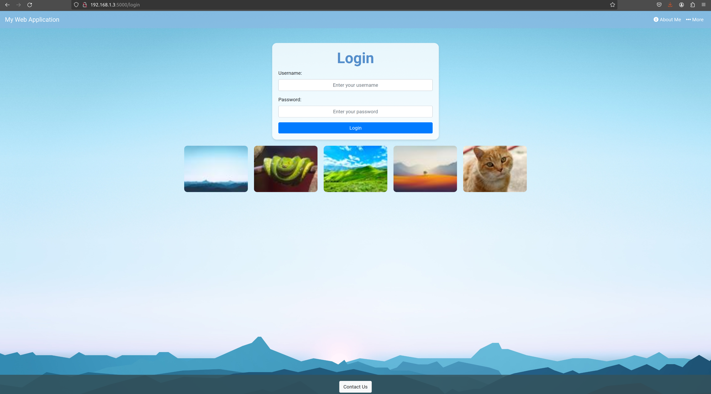
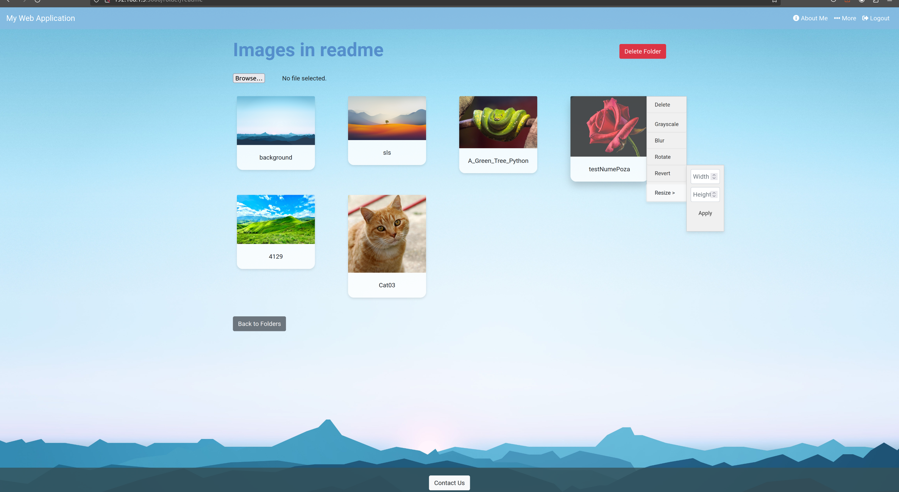

  

<h3 align="center">Web Application</h3>

---

 Aceasta este o aplicație web de gestionare a imaginilor construită folosind Flask. Aplicația permite utilizatorilor să încarce imagini, să creeze foldere, să aplice filtre de imagine și să gestioneze imaginile într-un mod simplu și eficient.
      

## 📝 Table of Contents

- [Problem Statement](#problem_statement)
- [Back - End](#back-end)
- [Front - End](#frontend)
- [Future Scope](#future_scope)
- [Conclusion](#conclusion)

## 🧐 Problem Statement 

- IDEAL: În starea ideală, aplicația de gestionare a imaginilor ar permite utilizatorilor să încarce, să gestioneze și să editeze imagini într-un mod intuitiv și eficient. Utilizatorii ar avea acces la o interfață ușor de utilizat pentru a crea și șterge foldere, a aplica filtre de imagine, a redimensiona imagini și a crea thumbnail-uri. Autentificarea utilizatorilor ar fi securizată, iar datele lor ar fi gestionate în siguranță. În plus, aplicația ar putea fi rulată într-un container Docker pentru o implementare ușoară și consistentă în diferite medii.
- REALITY: În prezent, aplicația este funcțională și oferă majoritatea funcționalităților descrise în starea ideală, cum ar fi încărcarea și gestionarea imaginilor, crearea de foldere și aplicarea de filtre. Cu toate acestea, există anumite limitări în ceea ce privește optimizarea codului și gestionarea erorilor. De asemenea, documentația și ghidurile pentru utilizatori și contribuitori sunt limitate, ceea ce poate îngreuna utilizarea și dezvoltarea ulterioară a aplicației. Codul actual include funcționalități esențiale, dar ar putea beneficia de îmbunătățiri suplimentare pentru a spori ușurința în utilizare și securitatea.

## 💡 Back - End 

Aplicația backend pentru gestionarea imaginilor este construită folosind framework-ul Flask, care oferă o structură simplă și flexibilă pentru dezvoltarea aplicațiilor web. Aplicația se bazează pe Flask pentru routing, gestionarea sesiunilor și autentificarea utilizatorilor, utilizând extensia Flask-Login pentru a facilita acest proces. Datele utilizatorilor sunt stocate într-o listă de obiecte User, iar autentificarea se face prin verificarea credențialelor introduse în formularul de login. Odată autentificat, utilizatorul poate accesa diferite funcționalități ale aplicației, cum ar fi încărcarea și gestionarea imaginilor, crearea de foldere și aplicarea de filtre asupra imaginilor. Fiecare imagine încărcată este stocată într-un folder specific, iar thumbnail-urile sunt generate automat folosind biblioteca PIL (Python Imaging Library). Utilizatorii pot aplica diferite filtre asupra imaginilor, cum ar fi conversia în grayscale, aplicarea unui efect de blur sau rotirea imaginii. De asemenea, aplicația permite redimensionarea imaginilor la dimensiuni specificate de utilizator și restaurarea versiunii originale a imaginii dintr-un folder de backup. Gestionarea fișierelor este realizată prin funcții ce permit verificarea extensiei fișierelor încărcate, crearea de foldere noi și ștergerea folderelor existente. Toate aceste operațiuni sunt securizate prin decoratori de autentificare, asigurând astfel că doar utilizatorii autentificați pot efectua modificări asupra conținutului. În plus, aplicația include un endpoint '/about' care servește o pagină statică de informații despre aplicație. În cele din urmă, pentru a rula aplicația într-un mediu Docker, este furnizat un fișier Dockerfile care configurează imaginea Docker necesară pentru rularea aplicației, inclusiv instalarea dependențelor și expunerea portului 5000.

## ⛓️ Front - End 

Partea de front-end a aplicației de gestionare a imaginilor este concepută pentru a oferi o interfață prietenoasă și intuitivă utilizatorilor. Aceasta utilizează HTML, CSS și JavaScript pentru a crea o experiență de utilizare dinamică și interactivă. Structura generală a aplicației este împărțită în mai multe șabloane HTML care sunt gestionate de framework-ul Flask.

 ### Pagina de Login
 
Pagina de login este punctul de intrare al utilizatorilor în aplicație. Aceasta folosește framework-ul Bootstrap pentru a asigura un design responsiv și modern. Formularul de autentificare solicită utilizatorilor să introducă un nume de utilizator și o parolă. În plus, pentru a face interfața mai atractivă, sunt utilizate animații CSS.

 ### Pagina Principală - Gestionarea Folderelor

<table>
<tr>
<td width="70%">
Odată autentificați, utilizatorii sunt redirecționați către pagina principală, unde pot vizualiza și gestiona folderele de imagini. Fiecare folder este reprezentat printr-o carte Bootstrap care afișează numele folderului și o imagine reprezentativă, dacă aceasta există. Utilizatorii au posibilitatea de a crea foldere noi prin intermediul unui formular simplu. Designul acestei pagini este curat și organizat, facilitând accesul rapid la funcțiile principale.
</td>
<td width="30%">

</td>
</tr>
</table>

### Vizualizarea și Gestionarea Imaginilor

<table>
<tr>
<td width="30%">

</td>
<td width="70%">
În interiorul fiecărui folder, utilizatorii pot încărca imagini noi, aplica filtre, redimensiona și șterge imagini. Fiecare imagine este afișată într-un card individual, iar la trecerea cursorului deasupra imaginii, utilizatorii au acces la mai multe butoane pentru gestionarea acesteia. Aceste butoane permit aplicarea de filtre (grayscale, blur, rotate), redimensionarea imaginii și ștergerea acesteia. Funcționalitatea de previzualizare a imaginii înainte de încărcare este implementată cu ajutorul JavaScript, oferind utilizatorilor un mod vizual de a confirma selecția făcută.
</td>
</tr>
</table>

 ### Pagina About Me

Aplicația include și o pagină "About Me", unde utilizatorii pot găsi informații despre creatorul aplicației sau despre proiect în sine. Această pagină este stilizată folosind Bootstrap și include secțiuni pentru contact și alte informații relevante. Designul păstrează consistența cu restul aplicației, asigurând o experiență de utilizare uniformă și plăcută.

 ### Stilizarea și Animațiile

Stilizarea generală a aplicației este realizată folosind CSS personalizat, pe lângă Bootstrap. Elementele vizuale precum butoanele, cardurile și formularele sunt proiectate pentru a fi atrăgătoare și ușor de utilizat. Animațiile CSS adaugă un strat suplimentar de interactivitate, făcând ca navigarea prin aplicație să fie mai plăcută. De exemplu, cardurile care reprezintă folderele de imagini se animă ușor atunci când utilizatorul trece cu mouse-ul peste ele, indicând clar elementele interactive.

### 😎 Prerequisites

Ce aveți nevoie pentru a aplicatia web.

    Python 3.9+: Este necesar pentru a rula aplicația Flask.
    pip: Sistemul de gestionare a pachetelor pentru Python.
    Docker (opțional): Pentru rularea aplicației într-un container Docker

## 🚀 Future Scope 

În timpul dezvoltării inițiale a aplicației de gestionare a imaginilor, multe funcționalități esențiale au fost implementate pentru a asigura o experiență de utilizare robustă și eficientă. Cu toate acestea, există mai multe direcții în care proiectul poate evolua pentru a îmbunătăți și extinde capacitățile aplicației.

## 🏁 Conclusion 

Proiectul de gestionare a imaginilor reprezintă un exemplu de succes al utilizării tehnologiilor web moderne pentru a rezolva probleme reale și pentru a îmbunătăți productivitatea utilizatorilor. Deși am realizat multe în timpul dezvoltării inițiale, există întotdeauna loc pentru îmbunătățiri și extindere. Prin continuarea dezvoltării și implementarea funcționalităților avansate și a optimizărilor, proiectul nostru poate deveni un instrument și mai valoros pentru utilizatori, contribuind la eficiența și creativitatea acestora. În concluzie, suntem mândri de ceea ce am realizat până acum și privim cu încredere către viitor, unde vom continua să îmbunătățim și să extindem această aplicație pentru a răspunde nevoilor în continuă evoluție ale utilizatorilor noștri.